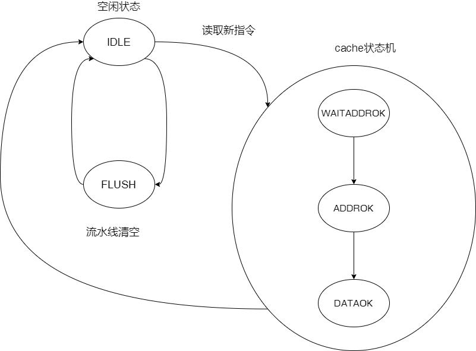
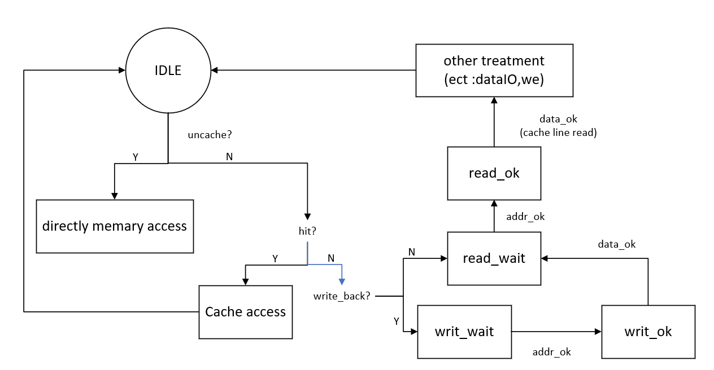
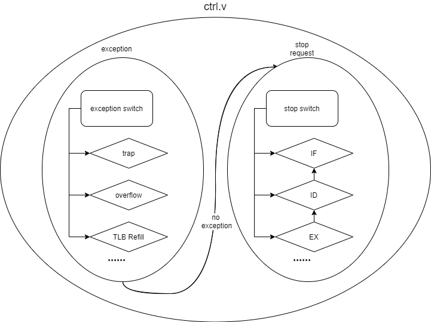

# 处理架构

**GadgetMIPS**的设计采用主流的五级流水线化，即分为**取指（IF\)、译码（ID）、执行（EX\)、访存（MEM）及写回（WB）。**


* 取指：指从内存中读取指令的过程；
* 译码：翻译从内存中取出的指令的过程。译码后，得到指令的操作数寄存器索引，可用于从通用寄存器组中读出操作数；
* 执行：在指令被解码后，已知所需的计算类型，并从通用寄存器组中读出所需的操作数，然后执行该指令）。指令的执行是对指令进行实际操作的过程；
* 访存：内存访问指的是内存访问指令从内存中读出数据或将数据写入内存的过程；
* 写回：将指令执行的结果写回通用寄存器组的过程。如果是一般的操作指令，其结果值来自于执行阶段的计算结果；如果是内存读取指令，其结果来自于访存阶段从内存中读取的数据；

此外，为支持其他功能，**GadgetMIPS**需要有其他组件的支持。基本的控制以及异常由`ctrl.v`以及`cp0.v`实现。至于更加复杂的功能（如TLB设计），将在后续的章节单独讲解。

## 流水线

流水线大致包含两级：一级为处理阶段，主要以连线成，用于各类信号的分析与连接，如`if.v`等；另一部分作为中介寄存器，如`if_id.v`等。

设计过程基本参照雷思磊的《自己动手写CPU》完成，因此主体结构可以参照该书籍，这里仅挑一些重点更改说明。

### 取指：if.v

```text
module sram_if(
    input wire clk,
    input wire rst, 

    input wire[5:0] stall,

    // 分支跳转信号
    input wire is_branch_i,
    input wire[`RegBus] branch_target_address_i,

    // 异常
    input wire flush,
    input wire[`RegBus] epc,
    output wire[31:0] exceptions_o,

    output wire[`RegBus] pc,
    
    // 指令存储器使能信号
    output reg req,
    input wire addr_ok,
    input wire data_ok,
    output wire[3:0] burst,
    output wire[`RegBus] addr,
    input wire[511:0] inst_rdata_i,
    output wire[`RegBus] inst_rdata_o,

    output wire stallreq
    );
```

总体上，整个功能分为四大模块：

* 跳转分支：接受来自译码返回的信号判定`is_branch_i`，并接受执行返回的跳转地址`branch_target_address_i`。这部分将会转移下一次取指令的地址；
* 异常检测：接受控制模块发来的暂停信号`flush`，用于清空流水线。若检测到异常（如指令未对其）则向控制模块发起请求、阐述原因；同时，这部分也负责在CPU其他模块出现异常时接受`epc`，跳转 取指位置于异常处理程序处；
* 取指：这部分实际上是通过一个icache与外存进行交互。过程是采用类SRAM协议实现的：向外发出信号，进行握手事务，最终得到数据（详见“总线转换桥”）。得到的指令`inst_rdata_i`将会分析后传给通过`inst_rdata_o`，供下一级译码使用；
* 暂停流水线：此功能主要是为了icache进行服务。由于与外存交互可能花费不止一个周期，期间流水线必须进行等待。通过`stallreq`向控制模块发起请求，抑或是通过接受`stall`来得知其他模块的暂停信号，都会对流水线运行产生影响。

取指阶段将从外部只读存储器中读取一条指令，并更新程序计数器指向下条指令。**GadgetMIPS**访问外部存储器时按照字节寻址,每次对齐地读入32位,即访问\[0x00, 0x03\]中任意-一个地址，都返回地址为0x00~0x03的4字节数据，这也是为了迎合MIPS32R1指令集 中要求访存与取指的地址都必须对齐的要求。 

此外，该阶段还负责响应由译码阶段传来的跳转指令:译码阶段给出跳转信号与新的程序地址, 该阶段响应信号并将新的地址写入PC，随即便按照新的PC进行取指。

```text
always @ (posedge clk) begin
    if (rst == `RstEnable) begin
        state <= `IDLE;
        req <= 1'b0;
        flush_wait <= 1'b0;
    end else if (flush) begin
        if(state != `IDLE && state != `DATAOK) begin
            state <= `FLUSHWAIT;
            flush_wait <= 1'b1;
        end 
    end else if (ce == 1'b1) begin
        case (state)
            `IDLE: begin
                if(pc[1:0] != 2'b00) begin
                    req <= 1'b0;
                end else if(!hit) begin//cache读缺失
                    state <= `WAITADDROK;//进入等待地址确认状态
                    req <= 1'b1;
                end else begin
                    req <= 1'b0;
                end
            end
            `WAITADDROK: begin
                if(addr_ok == 1'b1) begin
                    req <= 1'b0;
                    state <= `ADDROK;
                end
            end
            `ADDROK: begin
                if(data_ok == 1'b1) begin
                    state <= `DATAOK;
                end 
            end
            `DATAOK: begin
                state <= `IDLE;
            end
            `FLUSHWAIT: begin
                if(data_ok) begin
                    state <= `IDLE;
                    flush_wait <= 1'b0;
                end
            end
        endcase
    end
end
```

`if.v`最终挂载了icache。这个部分是通过Xlinx的ip核**distribute RAM**实现的：`if.v`通过`pc_reg.v`实现了一次预取，新的地址将会送向cache来提前判断是否命中，避免了Hit判断额外的时间开销。

流程状态机转换如下图：icache将会保持空闲状态，直到新的指令需求提出且未在cache内部找到，随后进入标准的SRAM握手流程接受内存发来的数据。除此之外，为了实现流水线清空，icache需要接受控制模块`ctrl.v`发来的重置信号，且这个信号只能在空闲状态接受（无论如何，不应打断数据接收的握手流程）。



### 取指——译码中介：if\_id.v

由于一个时钟周期内IF分别要完成拿取新的指令及完成PC的更新，而后续电路要求前一阶段提供的PC值与指令值在-一个时钟周期内是保持不变的；如果跳转指令在计算新的PC值时IF阶段跳转PC到了下一条指令，那么新计算出来的目标PC值也就不对了，而在设计CPU的时候何时更 新PC完全是根据硬件寄存器的延迟决定的，因此避免这种窘况的最好方法就是在IF和ID阶段之间 插入一个锁存器，将ID阶段所需要的各种信号锁存并保持一个时钟周期。

### 译码阶段：id.v

译码阶段没有太大的改动，除了一点：在后续较为重要的对TLB的支持。原先通过一个32位的异常处理信号`exceptions_o`处理，而雷思磊的样例并没有支持太多的异常，因此可以在高位进行扩充。改动后，`id.v`即可支持TLB指令以及可能出现的4种异常：

```text
 always @ (posedge clk) begin
    if(rst == `RstEnable) begin
        exception_is_refetch = 1'b0;
    end else begin
        case (exception_is_refetch)
            1'b0: begin
                if(exception_is_tlbwi |
                   exception_is_tlbwr |
                   exception_is_tlbp  |
                   exception_is_tlbr) begin
                    exception_is_refetch <= 1'b1;
                end else begin
                    exception_is_refetch <= 1'b0;
                end
            end
            1'b1: begin
                exception_is_refetch <= 1'b0;
            end
            default: begin
            end
        endcase
    end
end

...
assign exceptions_o = {exception_is_tlbp,
                       exception_is_tlbr,
                       exception_is_tlbwi,
                       exception_is_tlbwr,
                       exception_is_refetch,
                       exceptions_i[26:5],
                       exception_is_syscall,
                       exception_is_break,
                       exception_is_eret,
                       inst_valid,
                       exceptions_i[0]};
```

另外，如果出现一条从未规定过的指令，**`id.v`一般会将其解析为NOP**。这位我们后续指令扩展与填充提供了方便。

### 译码——执行中介：id\_ex.v

除了锁存并保持必要的信号满一个时钟周期之外，该锁存器还要 利用其单拍延迟锁存状态信号为下一条指令提供指示。这部分同样仅仅起到一个锁存的作用，没有过大的创新，因此略过。

### 执行：ex.v

本阶段将按照ID产生的信号对数据进行操作，即运算。

CPU支持的全部运算将在这一阶段执 行，其中简单运算，如逻辑运算、位移运算、加减乘等都是利用Verilog 内置运算符完成，综合时将 自动产生相应电路；除法则使用试商法构建多周期除法器进行运算。多周期运算执行时需要暂停流水线等待运算结束。

展示一个除法器的样例：


这部分新增了两处改动：

* 对TLB指令的执行、异常信号的再判断、处理；
* 为流水化cache，**对地址信号命中的预判断，实现信号前提**（与if.v的icache处理同理）

```text
assign exceptions_o = {exceptions_i[31:12],
                           tlb_mapped & load_store ? (((tlb_hit & store) & (tlb_v & !tlb_d)) ? 1'b1 : 1'b0) : 1'b0,
                           tlb_mapped & load_store ? !tlb_hit : 1'b0,
                           tlb_mapped & load_store ? (tlb_hit & !tlb_v ? 1'b1 : 1'b0) : 1'b0,
                           exceptions_i[8:7],
                           trap_occured,
                           overflow_occured,
                           exceptions_i[4:0]};
```

```text
// 判断是否为数据操作
    wire load_store = (aluop_i == `MEM_OP_LB  | 
                       aluop_i == `MEM_OP_LH  |
                       aluop_i == `MEM_OP_LWL |
                       aluop_i == `MEM_OP_LW  |
                       aluop_i == `MEM_OP_LBU |
                       aluop_i == `MEM_OP_LHU |
                       aluop_i == `MEM_OP_LWR |
                       aluop_i == `MEM_OP_SB  |
                       aluop_i == `MEM_OP_SH  |
                       aluop_i == `MEM_OP_SWL |
                       aluop_i == `MEM_OP_SW  |
                       aluop_i == `MEM_OP_SWR);

    wire store = (aluop_i == `MEM_OP_SB  |
                       aluop_i == `MEM_OP_SH  |
                       aluop_i == `MEM_OP_SWL |
                       aluop_i == `MEM_OP_SW  |
                       aluop_i == `MEM_OP_SWR);
```

### 执行——访存中介：ex\_mem.v

同前；除了锁存必要信号与提供下一条指令的部分之外，该锁存器还需要在流水线暂停时为EX阶段提供多周期指令执行时状态机所需要的必要信号。

### 访存：mem.v

这一部分篇幅改动较大，因为它是挂载dcache的关键代码段。

**GadgetMIPS**与**hhhhMIPS**采用的dcache设计思路有较大的不同：**GadgetMIPS**预设为采用《CPU设计实战》的流水设计（见后续“cache流水线优化”），然而因为线路过于庞大，实验效果与理想偏差较大，最终采取了二路组相联的方式些许提升；而**hhhhMIPS**采用的更为连贯的流水线设计，成功将性能提升了一个极大的档次（如果您有兴趣，可以在介绍中找到这一份代码的git地址）。

**GadgetMIPS**的dcache采用的是行写回、写优先的架构，并在组相联中采取了一个位移随机数发生器作为替换路的选择（见`LSFR.v`）：

```text
LSFR random_generator(
    .clk(clk),
    .rst(rst),
    .rand(rand)
);

reg way_choose;

...

always @(*) begin
    if (rst == `RstEnable) begin
        way_choose <= 1'b0;
    end
    else if (state == `IDLE) begin
        if (hit_total) begin
            way_choose <= hit_1;
        end
        else begin
            way_choose <= rand[0];
        end
    end
    else begin
    end
end
```

核心状态机转换如下：


由于龙芯 支持的指令一般位于0xbfc00000位置处开始执行（即MIPS32中的kseg段），这部分是属于uncache的部分，**不允许外设强行在这个地方缓存数据，**因此这里额外需要一个判断：当出现uncache时，单独走一个内存访问的流程，而不是在原来的基础上修改。相关见“总线转换桥”。




由于涉及外设访问、事务等待及握手处理，`mem.v`可以说是整个CPU里耗时最长的一个部分，同时也是用时最不稳定的一个部分（取决于cache是否命中数据），这也就决定了需要长时间的暂停来满足这一需求。分析可知存在以下几种可能

* 读且命中：这种情况可以直接从cache内获取数据，且当拍即可完成，自然不需要暂停；
* 写且命中：由于cache设计采用写回的模式，因此可以直接对cache内部的数据进行更改，并将其添加一个脏数据标记，而并非直接访问内存、消耗宝贵的时间。此设计结构可以保证写命中同样也可以一周期内完成，而写操作本身并不需要返回结果，完全可以令cache自己运行，并使其他模块进行下一条指令的准备工作；
* 最后一组数据返回：这种情形表示访问已经完全结束，不再需要进行其他的等待；相应地，给予的暂停信号应当得到撤销；
* 其他：数据还在等待传输的流程完成，需要使暂停延续下去。

最终设计如下。和之前模块一样，`mem.v`将通过`stallreq`信号向控制器发起请求。为了保证状态与暂停同步，信号的发送采用了组合逻辑实现。

```text
always @(*) begin
    if(rst == `RstEnable)begin
        stallreq <= 1'b0;
    end else begin
        case(state) 
            `IDLE: begin
                if(mem_ce) begin
                    stallreq <= ~hit_total;
                end else begin
                    stallreq <= `False_v;
                end
            end
            `READWAIT: begin
                stallreq <= `True_v;
            end
            `READOK: begin
                stallreq <= `True_v;
            end
            `WRITEWAIT: begin
                stallreq <= `True_v;
            end
            `WRITEOK: begin
                stallreq <= `True_v;
            end
            `UNCACHEWAIT: begin
                stallreq <= `True_v;
            end
            `UNCACHEOK: begin
                if (!mem_data_ok) begin
                    // 数据握手不成功，原地等待
                    stallreq <= `True_v;
                end else begin
                    // 数据握手成功，立刻撤销流水线暂停
                    // 转入空闲阶段
                    stallreq <= `False_v;
                end
            end
            default: begin
                stallreq <= `False_v;
            end
        endcase
    end
end
```

### 写回与其他

写回过程非常简单：读取之前模块发送的寄存器地址与数据，当写使能有效时更改数据。这部分同样可以略过，抑或是在**GadgetMIPS**上源码及《自己动手写CPU》找到更详细的说明。

只需注意一点：写回寄存器时，之后的指令执行读取操作可能会发生写后读相关，因此指令在向寄存器堆读取数据之前，会同时展望这些模块，观察它们正在写入的寄存器编号。一旦确认与目前读的位置一致，读取过程将会选择写回等模块所采用的数据，而非从寄存器读取的数据，作为该指令最终读取的结果。

## 其他支持

### 总控制器：ctrl.v



总控制器的代码并不多，但功能尤为重要。它负责两大功能：

* 根据异常更改PC，取指过程入口转向对应的异常处理程序；
* 接受暂停信号，仅允许发起信号模块之后余下的流程完成，其余部分暂停实施。

异常处理程序是实现高级功能中最为基础的部分。`ctrl.v`并不会自我保存异常地址入口，而是通过外部模块告知实现，这种设计是为了便于兼容及日后开发。除了一点以外：异常处理流程中保存了0xbfc00380这个位置，这是因为很多MIPS32设计都采取这个位置作为默认的处理入口，因此相应地，我们也保留了这个默认的异常程序地址。

当目前一切正常时，`ctrl.v`才会继续检查暂停判断。不同的模块有可能在同一时间发起暂停请求，接受以后暂停该模块的运行。与异常处理不同的一点是：暂停不仅会影响当前模块，还会影响流水线之前的那一些模块（自然，堵塞了后续过程，前面的指令不应该实施）。最终，控制器将会暂停最排后模块之前的所有执行步骤，直至得到响应、暂停请求得以终止。

```text
always @ (*) begin
        stall <= 6'b000000;
        flush <= 1'b0;
        if(rst == `RstEnable) begin
            epc_o <= `ZeroWord;
        end else if(exception_occured_i) begin
            // 有异常
            flush <= 1'b1;
            case (exc_code_i)
                // 根据异常类型判断pc要写入的值
                5'h10: begin
                    // ERET调用
                    epc_o <= cp0_epc_i;
                end 
                default: begin
                    // 其他异常统一入口
                    epc_o <= 32'hBFC00380;
                end
            endcase
        end else if(stallreq_from_mem == `Stop) begin
            stall <= 6'b011111;
        end else if(stallreq_from_ex == `Stop) begin
            stall <= 6'b001111;
        end else if(stallreq_from_id == `Stop) begin
            stall <= 6'b000111;            
        end else if(stallreq_from_if == `Stop) begin
            stall <= 6'b000111; // ID跟着暂停，应该可以解决跳转的问题
            // TODO 与MEM竞争被仲裁等待时，ID是否应该额外暂停？         
        end else begin
            stall <= 6'b000000;
        end
    end
```


