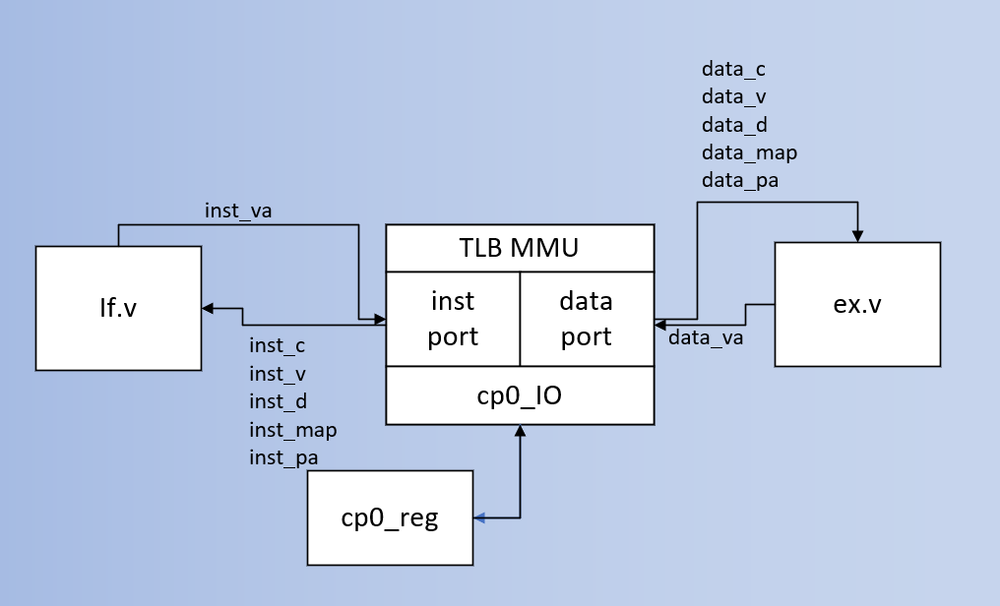

# TLB设计

和其他主流操作系统一样，MIPS32同样具有基于页表的页式存储管理，通过虚实地址切换的过程最终实现。

在MIPS CPU \(以及所有的现代CPU上\)上，地址转换以4KB大小为单位，称为页。页内的低12位地址只是从虚拟地址简单地传递到物理地址。 转换表中每一项含有一个页的虚拟地址\(VPN，即虚拟页号\)和一个物理页地址\(PFN，代表页帧号\)。当程序给出一个虚拟地址时，该地址和TLB中的每 个VPN做比较，如果和某项匹配就给出相应的PFN。

TLB是一种称之为相联存储器或者内容寻址的存储器，不是按照索引来选择而是根据内容来选择 某一项。这逻辑是相当复杂的，其中每一项都有内建的比较器，复杂度和性能扩展性很差，所以典型的TLB只有16到64项。实验后，**GadgetMIPS**和**hhhhMIPS**规定采用了32项，定义于`tlb_mmu.v`中。



## 查询流程

TLB查询和cache比对比较类似：它将读取虚拟地址的标志区域（虚拟页号），然后返回实际的物理页号以及该物理页的各种属性。这个模块实际上是**常驻的**，即读取任意一条l/w指令，其地址都应被视为虚拟地址、应当送入TLB内进行解析。

查询并不困难：比对每一项标志，返回命中项。但有几个需要注意的点：并非所有地址都能够在TLB项中成功查询到结果；并非所有地址都应该与TLB项中比对进行查询。前者是由于TLB时常发生变化而导致的不确定性（如CPU刚开始运行，此时TLB内部显然没有有效的数据）；后者是MIPS32自己独立设置的特性（见“MIPS32虚拟地址空间架构”）。处理方法上，前者将会被视为一个异常而处理，而后者将根据所处的区域进行一定的特定转换后直接导出结果。

伪代码描述如下：

```text
found ← 0
for i in 0...TLBEntries-1
    if ( (TLB[i].VPN2 and not (TLB[i].Mask )) = (va 31..13 and not (TLB[i].Mask ))) and (TLB[i].G or (TLB[i].ASID = EntryHi.ASID )) then
        if va12 = 0 then
            pfn ← TLB[i].PFN0
            v ← TLB[i].V0
            c ← TLB[i].C0
            d ← TLB[i].D0
        else
        pfn ← TLB[i].PFN1
            v ← TLB[i].V1
            c ← TLB[i].C1
            d ← TLB[i].D1
        endif
        if v = 0 then
            SignalException(TLBInvalid, reftype)
        endif
        if (d = 0) and (reftype = store) then
                SignalException(TLBModified)
        endif
        # pfn 19..0 corresponds to pa 31..12
        pa ← pfn19..0 || va11..0
        found ← 1
        break
    endif
endfor

if found = 0 then
    SignalException(TLBMiss, reftype)
endif
```

## MIPS32虚拟地址空间架构


可以看到，整个空间被划分成了4个部分：

* **kuseg（用户空间）：**这个地方供用户使用，划分出了2GB的空间。理论上来说，供用户使用的不应超过这个范围；
* **kseg0（cached直接映射）：**这部分的虚拟地址不允许TLB进行其他映射访问，而是映射到物理地址的最底层，即0x00000000~0x1fffffff的位置（即高三位抹为0）。
* **kseg1（uncached直接映射）：**与kseg0相同，这部分同样映射到0x00000000~0x1fffffff的位置。但有一点注意：这个位置的访问**不允许cache缓存。**换言之，当CPU尝试访问虚拟地址为此区域的内存时，无论是否采用burst传输，内存应当保证**一次请求仅返回一个数据**。
* **kseg2/3（保留空间）：**这部分内容与kuseg一样需要查找TLB表，一般留作内核自我的数据栈。

特别注意两点：部分区域不能通过TLB查询；部分区域不允许cache缓存 。这两点在后续的编写中会提到。

## TLB表项及相关寄存器

### TLB表项


单个TLB表项长度为90位，它包括：

* **VPN2：**19位，虚拟地址高位。虚拟地址同样有该部分，查询TLB过程实际上即为虚拟地址匹配该字段、同时返回对应信息的过程；
* **ASID：**8位，地址空间标识。当查得的TLB表项不为全局可用时（即**G**不为有效），还需要对此字段进行新的比较过程；
* **PageMask：**12位掩码
* **G：**1位，全局属性标识符。它表示这个TLB表项是否全局可用，若无效，则使用该TLB表项时还要额外核对**ASID**字段；
* **EntryLo：**共有两个部分，和EntryLo0、EntryLo1进行数据交换。

### EntryHi


MIPS32中EntryHi只用到了高位和低位。它作用主要是作为一个进程指示，保存当前进程所用到的虚拟页号以及地址标识符。每当进程切换时，该寄存器的内容都会改变，同时保证不同进程运行时不会有相同的数据，借此保证了安全性。

### EntryLo


EntryLo实际上有两个寄存器，编号为0和1，对应TLB低50位共2个部分。虚拟地址的高19位作为VPN2，低12位作为4KB的页内偏移原封不动，余下的第12位即为选择位，选择0或1对应的内容。两个寄存器只有遇见特定的TLB指令才会发生更改。

数据格式如下：

* **PFN：**26位，物理页号。TLB表项中的PFN查询后被输出，与虚拟地址余下的偏移量拼接，得到38位的物理地址结果 ；
* **C：**2位，决定cache属性。这个属性主要由软件以及系统用来优化，决定该页指向的数据允许缓存（cacheable noncoherent，2'b11）抑或是非缓存（uncache，2'b10）；
* **D：**1位，脏位。表示该页是否发生写更改；
* **V：**1位，有效位；
* **G**：1位，全局标识位。当两个 寄存器写入TLB表项时，TLB表项的**G**即为两个寄存器的**G**与运算的结果。


虽然在MIPS32标准下，拼接后最多允许256GB空间的访问，但鉴于对外接口是32位的，最终**GadgetMIPS**以及**hhhhMIPS**仍采用32位而非38位输出，EntryLo的PFN相应位置被默认置0。


### Index

MIPS32将其归为一个很“空闲”的寄存器，仅在特殊查询时启用。它的低位保存匹配所需的TLB表项号（因我们设为了32项，所以采取5位）。最高位用于在查询异常时作为指示位。

## TLB架构

`tlb_mmu.v`展示了TLB的构成。鉴于取指以及访存阶段同时需要访问内存，因此TLB模块为两个部分各自单独设计了端口：输入虚拟地址，返回物理地址；同时，为了减少相关信号的依赖，将C，D，V，TLB命中等信号位传出用于判断异常；将是否映射传出用于判断是否应采用查询的物理地址。

另外，为支持异常及TLB指令，TLB需要与CP0寄存器组进行交互 ，及时更新数据。

```text
module tlb_mmu(
    input wire clk,
    input wire rst,

///////////////////////////////////////////////////////////
// tlb_op:
// 3: tlbP
// 2: tlbr
// 1: tlbwi
// 0: tlbwr
///////////////////////////////////////////////////////////
    input wire[3:0] tlb_op,


    // icache读tlb接口: if
    input wire[`RegBus] inst_virtual_pc_i,
    output reg[`RegBus] inst_physical_pc_o,
    output reg          inst_tlb_hit,
    output reg[2:0]     inst_c,
    output reg          inst_d,
    output reg          inst_v,
    output reg          inst_mapped,

    // mem
    input wire[`RegBus] data_virtual_pc_i,
    output reg[`RegBus] data_physical_pc_o,
    output reg          data_tlb_hit,
    output reg[2:0]     data_c,
    output reg          data_d,
    output reg          data_v,
    output reg          data_mapped,

    // cp0 output
    input wire[`RegBus] index_i,
    input wire[`RegBus] random_i,
    input wire[`RegBus] entryLo0_i,
    input wire[`RegBus] entryLo1_i,
    input wire[`RegBus] entryHi_i,
    input wire[`RegBus] pageMask_i,

    // cp0 input
    output reg[`RegBus] index_o,
    output reg[`RegBus] entryLo0_o,
    output reg[`RegBus] entryLo1_o,
    output reg[`RegBus] entryHi_o,
    output reg[`RegBus] pageMask_o
);
```

取指/访存阶段的输出根据两个always组合逻辑块实现。对于位于kseg0/1的部分及寻找失败的情形进行特判，并用默认值填充：

```text
// inst 读
always @ (*) begin
    if(rst == `RstEnable) begin
        inst_tlb_hit <= `TLBMiss;
        inst_physical_pc_o <= `ZeroWord;
        inst_c <= 3'b000;
        inst_d <= 1'b0;
        inst_v <= 1'b0;
        inst_mapped <= 1'b0;
    end else begin
        inst_tlb_hit <= `TLBMiss;
        inst_physical_pc_o <= `ZeroWord;
        inst_c <= 3'b000;
        inst_d <= 1'b0;
        inst_v <= 1'b0;
        inst_mapped <= 1'b0;
        if(inst_virtual_pc_i[31:30] == 2'b10) begin
            // 此时地址处于unmapped区域
            inst_tlb_hit <= `TLBHit;
            inst_physical_pc_o <= {3'b000, inst_virtual_pc_i[28:0]};
            inst_c <= inst_virtual_pc_i[29] ? 3'b010:3'b011;                // 'uncached' or 'cacheable noncoherent'
            inst_d <= 1'b0;                                                 // default as 'clean'
            inst_v <= 1'b1;                                                 // default as 'valid'
            inst_mapped <= 1'b0;
        end else begin
            inst_tlb_hit <= (is_hit_inst ? `TLBHit:`TLBMiss);
            inst_physical_pc_o <= {inst_pfn_result, inst_virtual_pc_i[`VA_OFFSET]};
            inst_c <= inst_c_result;
            inst_d <= inst_d_result;
            inst_v <= inst_v_result;
            inst_mapped <= 1'b1;
        end
    end
end

// data 读
always @ (*) begin
    if(rst == `RstEnable) begin
        data_tlb_hit <= `TLBMiss;
        data_physical_pc_o <= `ZeroWord;
        data_c <= 3'b000;
        data_d <= 1'b0;
        data_v <= 1'b0;
        data_mapped <= 1'b0;
    end else begin
        data_tlb_hit <= `TLBMiss;
        data_physical_pc_o <= `ZeroWord;
        data_c <= 3'b000;
        data_d <= 1'b0;
        data_v <= 1'b0;
        data_mapped <= 1'b0;
        if(data_virtual_pc_i[31:30] == 2'b10) begin
            // 此时地址处于unmapped区域
            data_tlb_hit <= `TLBHit;
            data_physical_pc_o <= {3'b000, data_virtual_pc_i[28:0]};
            data_c <= data_virtual_pc_i[29] ? 3'b010:3'b011;                // 'uncached' or 'cacheable noncoherent'
            data_d <= 1'b0;                                                 // default as 'clean'
            data_v <= 1'b1;                                                 // default as 'valid'
            data_mapped <= 1'b0;
        end else begin
            data_tlb_hit <= (is_hit_data ? `TLBHit:`TLBMiss);
            data_physical_pc_o <= {data_pfn_result, data_virtual_pc_i[`VA_OFFSET]};
            data_c <= data_c_result;
            data_d <= data_d_result;
            data_v <= data_v_result;
            data_mapped <= 1'b1;
        end
    end
end
```

总体逻辑较为简单。

不过需要注意一点：如何与32个表项比较？若是一个个进行比较，要么需要32个时钟周期，要么被迫在一个周期内进行大量等待、直到先前比较完成才执行，所产生的时间冗余是无法忍受的。最好的一个办法就是**利用逐位或运算**，把比较任务交给电路并行完成，效率将会有极大的提升。

```text
assign hit_inst[0] = tlb_valid[0] & (inst_virtual_pc_i[`VA_VPN2] == tlb_ram[0][`TLB_VPN2]) && ((entryHi_i[`EntryHiASID] == tlb_ram[0][`TLB_ASID]) || tlb_ram[0][`TLB_G]);
assign hit_inst[1] = tlb_valid[1] & (inst_virtual_pc_i[`VA_VPN2] == tlb_ram[1][`TLB_VPN2]) && ((entryHi_i[`EntryHiASID] == tlb_ram[1][`TLB_ASID]) || tlb_ram[1][`TLB_G]);
assign hit_inst[2] = tlb_valid[2] & (inst_virtual_pc_i[`VA_VPN2] == tlb_ram[2][`TLB_VPN2]) && ((entryHi_i[`EntryHiASID] == tlb_ram[2][`TLB_ASID]) || tlb_ram[2][`TLB_G]);
assign hit_inst[3] = tlb_valid[3] & (inst_virtual_pc_i[`VA_VPN2] == tlb_ram[3][`TLB_VPN2]) && ((entryHi_i[`EntryHiASID] == tlb_ram[3][`TLB_ASID]) || tlb_ram[3][`TLB_G]);
...
```

```text
wire hit_inst[0:15];
wire is_hit_inst;
assign is_hit_inst = hit_inst[ 0] | hit_inst[ 1] | hit_inst[ 2] | hit_inst[ 3] |
              hit_inst[ 4] | hit_inst[ 5] | hit_inst[ 6] | hit_inst[ 7] |
              hit_inst[ 8] | hit_inst[ 9] | hit_inst[10] | hit_inst[11] |
              hit_inst[12] | hit_inst[13] | hit_inst[14] | hit_inst[15];

wire hit_data[0:15];
wire is_hit_data;
assign is_hit_data = hit_data[ 0] | hit_data[ 1] | hit_data[ 2] | hit_data[ 3] |
              hit_data[ 4] | hit_data[ 5] | hit_data[ 6] | hit_data[ 7] |
              hit_data[ 8] | hit_data[ 9] | hit_data[10] | hit_data[11] |
              hit_data[12] | hit_data[13] | hit_data[14] | hit_data[15];
```

## 扩展：TLB指令支持

MIPS32规定了共4条TLB指令：**TLBP、TLBR、TLBWI、TLBWR**：

| 指令 | 功能 |
| :--- | :--- |
| TLBP | 于TLB表中查询EntryHi对应内容 |
| TLBR | 将TLB表中Index寄存器对应的表项内容输入EntryLo寄存器 |
| TLBWI | 将EntryLo寄存器内容写回TLB表中Index寄存器对应的表项 |
| TLBＷR | 类似TLBWI，但表项编号来自随机数生成器而不是index寄存器 |

通常测试不需要考虑这些部分，但为运行操作系统，OS大多要求硬件支持这些指令来初始化TLB或实现进程管理。最终`tlb_mmu.v`成功实现了这些内容。

### TLBP、TLBR

TLBP、TLBR本质上都是读操作且均向CP0输出结果，因此集成于一个组合逻辑代码块内处理。发现操作即会改变对外输出信号，此后下一拍CP0将读取这些信号并更新。

像原先一样：通过并行的或位运算可以大幅提升效率（如`hit_hi_match_switch`）；

TLBP在标准之外新加了操作：若发现寻找异常，则会将Index低位全置为1，这个特殊处理或许能些微方便debug的调试过程。

```text
wire[`TLBWayBus]   hit_hi_match_NotFound;
assign hit_hi_match_NotFound = is_hit_hi_match ? 5'b00000:5'b11111;

wire[`TLBWayBus]   hit_hi_match_switch;
assign hit_hi_match_switch =    (hit_hi_match[0] ? 0:0)        |   (hit_hi_match[1] ? 1:0)         |
                                (hit_hi_match[2] ? 2:0)        |   (hit_hi_match[3] ? 3:0)         |
                                (hit_hi_match[4] ? 4:0)        |   (hit_hi_match[5] ? 5:0)         |
                                (hit_hi_match[6] ? 6:0)        |   (hit_hi_match[7] ? 7:0)         |
                                (hit_hi_match[8] ? 8:0)        |   (hit_hi_match[9] ? 9:0)         |
                                (hit_hi_match[10] ? 10:0)        |   (hit_hi_match[11] ? 11:0)         |
                                (hit_hi_match[12] ? 12:0)        |   (hit_hi_match[13] ? 13:0)         |
                                (hit_hi_match[14] ? 14:0)        |   (hit_hi_match[15] ? 15:0)         |
                                hit_hi_match_NotFound;

always @(*) begin
    case(tlb_op)
        4'b0100: begin
            entryHi_o <= {tlb_ram[tlb_index][`TLB_VPN2], 5'b00000, tlb_ram[tlb_index][`TLB_ASID]};
            entryLo0_o <= {6'b000000, tlb_ram[tlb_index][49:25], tlb_ram[tlb_index][`TLB_G]};
            entryLo1_o <= {6'b000000, tlb_ram[tlb_index][24:0],  tlb_ram[tlb_index][`TLB_G]};
            pageMask_o <= {7'b0000000, tlb_ram[tlb_index][`TLB_PageMask], 13'b0_0000_0000_0000};
        end
        4'b1000: begin
            index_o[31] <= ~is_hit_hi_match;
            index_o[30:5] = 26'd0;
            index_o[`TLBWayBus] <= hit_hi_match_switch[`TLBWayBus];
        end
        default: begin
        end
    endcase
end
```

### TLBWI、TLBWR

这两个命令同样是写操作，区别仅仅在于使用的下标发生了变化，因而放在了一块处理。当确认为TLBWR时，访问所用的下标将从外界的随机数生成器中取得，否则仍选择采用Index寄存器的输入。

```text
wire[`TLBWayBus] tlb_index;
assign tlb_index = tlb_op[0] ? random_i[`TLBWayBus] : index_i[`TLBWayBus];

// 写入TLB操作: tlbwi tlbwr
always @ (posedge clk) begin
    if(tlb_write_en) begin
        tlb_ram[tlb_index][`TLB_VPN2] <= entryHi_i[`EntryHiVPN2];
        tlb_ram[tlb_index][`TLB_ASID] <= entryHi_i[`EntryHiASID];
        tlb_ram[tlb_index][`TLB_PageMask] <= pageMask_i[`PageMask_Mask];
        tlb_ram[tlb_index][`TLB_G] <= entryLo0_i[`EntryLoG] & entryLo1_i[`EntryLoG];
        tlb_ram[tlb_index][`TLB_PFN0] <= entryLo0_i[`EntryLoPFN] & (~pageMask_i[`PageMask_Mask]);
        tlb_ram[tlb_index][`TLB_PFN0_C] <= entryLo0_i[`EntryLoC];
        tlb_ram[tlb_index][`TLB_PFN0_D] <= entryLo0_i[`EntryLoD];
        tlb_ram[tlb_index][`TLB_PFN0_V] <= entryLo0_i[`EntryLoV];
        tlb_ram[tlb_index][`TLB_PFN1] <= entryLo1_i[`EntryLoPFN] & (~pageMask_i[`PageMask_Mask]);
        tlb_ram[tlb_index][`TLB_PFN1_C] <= entryLo1_i[`EntryLoC];
        tlb_ram[tlb_index][`TLB_PFN1_D] <= entryLo1_i[`EntryLoD];
        tlb_ram[tlb_index][`TLB_PFN1_V] <= entryLo1_i[`EntryLoV];
        tlb_valid[tlb_index] <= 1'b1;
    end
    else begin
    end
end
```

## 扩展：TLB异常支持


