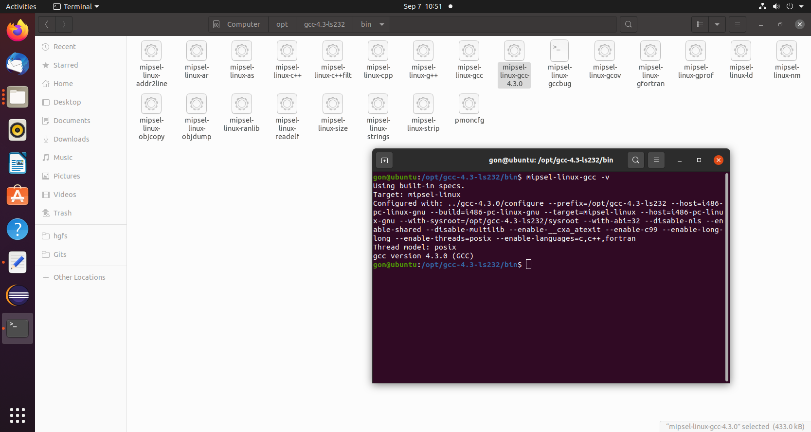
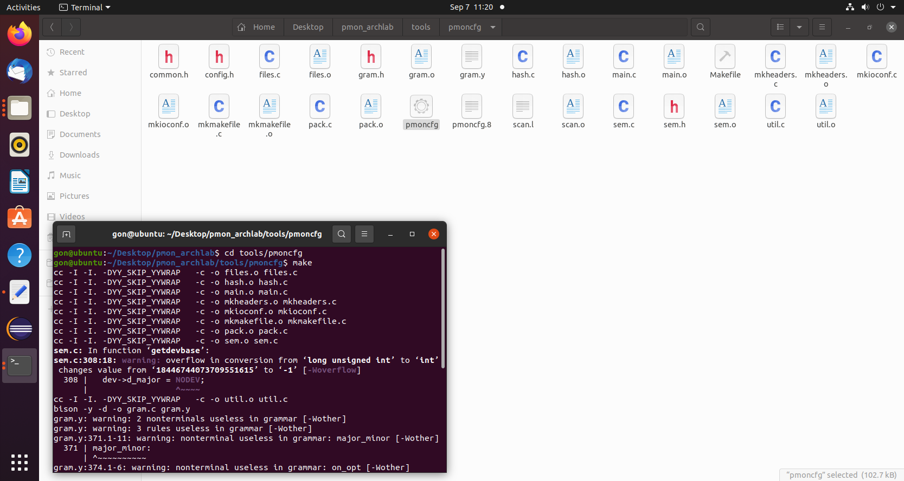
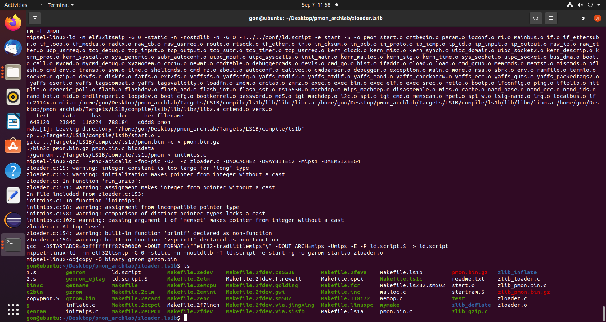
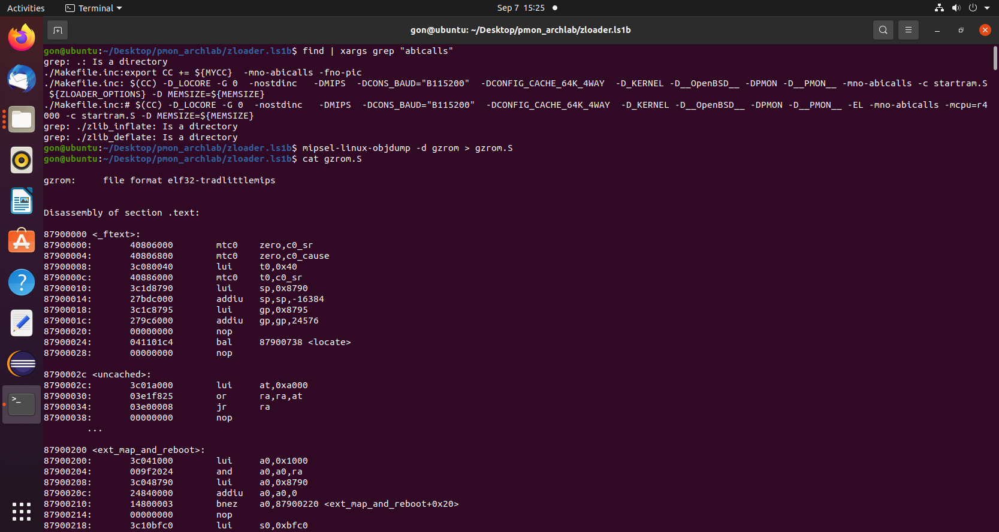
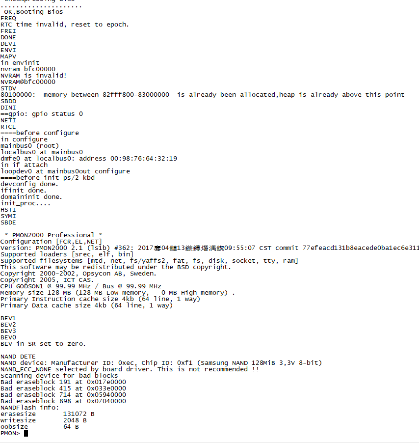
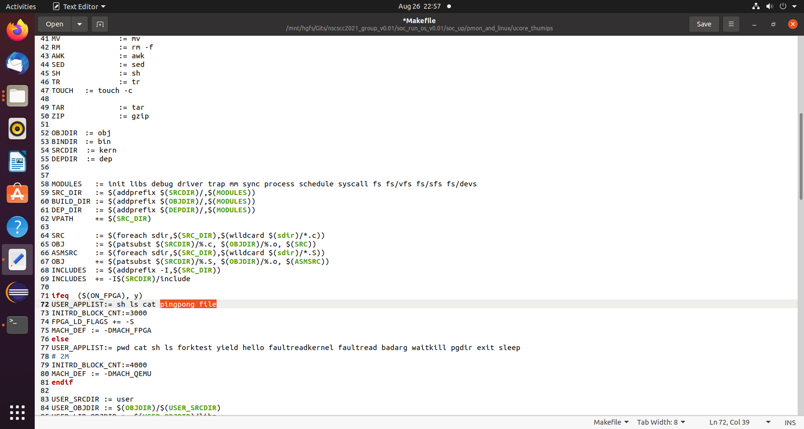

# 系统运行

## 运行准备

龙芯杯开源的 gs132 核搭建了一个小的 soc， 该 soc 外设有串口、flash 芯片和指令数据 ram。 该 soc 在 FPGA 上生成的 bit 流文件可实现通过串口在线编程 flash 芯片，而本次实验将在这个环境下进行运行。

## PMON

### 简介

PMON是一个兼有BIOS和boot loader部分功能的开放源码软件，多用于嵌入式系统。

与BIOS相比功能不足，与常见的bootloader 相比，功能要丰富的多。基于龙芯的系统采用 PMON作为类 BIOS 兼 bootloader，并做了很多完善工作。PMON支持的指令较为简单，因此我们选择PMON作为初步的系统测试样例；同时，由于PMON可以通过设置网关的方式在线加载程序，而不用固定我们操作程序的位置，PMON的成功运行可以为我们之后的μcore运行打下基础。

### 工具链安装

关于PMON，官方已经给予了所需的二进制文件`gzrom.bin`，理论上应该可以直接上板使用。然而最初**GadgetMIPS**并非作为一个专门实现系统的CPU进行设计，内部功能很有可能与预期不兼容，必要时需要确认源代码进行逐步排查 ；另外，直接采用二进制文件不利于后续添加功能与修改，最终小组预先找出了PMON的源代码，并开始着手重新编译工作。

与之前龙芯测试的程序编写相同，编译PMON需要采用专门的MIPS交叉编译工具链。我们采用的是原先官方专门对其比特流进行测试的`gcc-4.3-ls132`，该工具包中涵盖对MIPS32小端序的一系列编译支持。由于我们所需要的PMON采用C语言编写，因此我们选择`mipsel-linux-gcc`工具链作为编译PMON的途径。

为方便日后继续使用，该工具链的路径已被添加进入环境变量，至此，整个工具链即可正常于命令行使用了。



### 内核编译 & 反编译

PMON较为原始，因此并没有允许用户自己设置Makefile参数来自定义编译过程；取而代之的，PMON内部自行包含适用于不同环境的各个版本；同时，编译这些版本所用的相关参数需要通过内部工具编译生成。

PMON所需要的参数工具`pmoncfg`由`/tools/pmoncfg`生成，该过程依赖工具包bison与flex。执行`make`指令后该工具将会被生成，将其拷贝到上级目录或交叉工具链所处位置，以备后续编译使用。



对于本实验，ls1b版（`/zloader.ls1b/`）适合我们的要求。而由于采用新工具链，因此还需修改Makefile以采取正确的编译方式。生成目标文件的设定于`/zloader/Makefile.inc/`下，将原定默认的mips-elf设置为本次采用的mipsel-linux即可，否则将因工具链不匹配而编译失败。

之后,我们回到初始的ls1b版本目录下，运行`make`指令进行编译。大概10分钟左右的编译流程后，目录下生成我们自我编译的`gzrom.bin`文件。这个文件支持elf文件的操作，且可以作为 一个只读文件提供给FPGA运行:



生成内核已经完毕，只剩下最后一步：如何显示内核的源代码？虽然理论上可以通过直接查询PMON源码实现，但各个组块实在是过于冗杂分散。实际上，二进制文件由工具链生成，自然也有方法将其转换回去——利用相同工具链，对二进制代码进行反编译即可。

于二进制目录下运行`mipsel-linux-objdump -d gzrom > gzrom.S`；最后反编译代码即保存于`gzrom.S`中：



### 运行与修改

PMON的编译过程并不是太复杂，然而上板操作有一定的难度，原因在于管脚连接外设的过程相当繁琐。龙芯提供了一个专门的soc环境与外设相连，一定程度上缓解了这方面的压力；同时，龙芯提供了一个比特流用于烧写开发板上的flash，最终我们仅需将上一步编译的二进制文件通过串口上传给编程后的实验箱，PMON即可以得到正常运行。

在Linux终端下运行：

```bash
$ minicom -s
```

选择 Serial port setup，进入配置界面：


其中 E 行依据开发板上串口控制器的初始化代码中设置的波特率进行选择，需根据开发板上串口控制器的初始化代码中设置的波特率进行选择\(对于本次校验设备，波特率需选择 57600\)。

对于windows下 设置：采用的SecureCRTPortable进行Xmodem send传输模式，同样采取波特率57600。

复位实验箱，系统开始运行：



### 系统分析报告

PMON的系统结构较为简单，总体添加的部分并不多，所用的指令集基本与原要求吻合，但实际修改的过程中仍遇到了许多阻碍：

* 初始测试中，PMON会于内存检查（“Memory size”一行）后停止运行。这个问题困扰了小组成员数天，后选择抓取FPGA信号来检测，同时采用官方正常的比特流进行对比测试。结果让人匪夷所思：仅仅是cache的脏数据信号更新过程输入写错。将输入置为仅当接受来自CPU的写操作有效，即默认一重写就 认为是脏数据，问题迎刃而解（由此可见细节是多么重要）；
* 修正后PMON可以正常运行，但 运行过程中仍会不时发生崩溃现象。小组反编译了PMON的启动代码，发现需要cache指令来进行初始化，然而时间只有短短十天，重新更改cache似乎不太可取，因此我们将这些指令解析为了**NOP**，暂时避开对cache的清空；取而代之的，我们在verilog内部把这一步放于复位过程，交给FPGA手动实施。因此结果仍然能够保持复位以后cache中的数据全部刷新、不受脏数据的影响；
* 再次修正后，PMON已经可以完全正常操作了，但后续进行μcore的测试中反复读取内存后也会出现崩溃现象，这个问题直到临近结束前一天也没有解决，直到最后一晚发现PMON显示加载的cache大小与我们预设的严重不符（“Primary instruction cache”数行）。查询MIPS32标准手册后发现cache的加载控制实际上是置于CP0寄存器中的初始默认值，而并非交给软件检测。

更新数据后，PMON修改终于告一段落。


## μcore

### 简介

μcore用于清华大学计算机系本科操作系统课程的教学试验内容，属于一个微型操作系统，但功能已经相对较为完善，已经可以执行一般的用户操作。

加载μcore的过程比较繁琐，因为官方并没有像PMON一样为其专门构建一个soc运行环境，只能通过虚拟机加载运行（如`qemu`），抑或是手动编写bootloader部分。好在PMON内部已经包含了其他操作系统的加载功能，因此只需在本地构建ftp服务，通过网关加载传输给PMON即可。

### 测试程序

为验证μcore系统的正确性，我们设计了测试两个程序，并封装入μcore命令行进行测试。两个文件均需置于`/user/`位置，并修改Makefile相关参数加载 。

第一个测试文件为`file.c`，打印指定的信息。成功运行后，该CPU运行下的μcore将会输出“NSCSCC2021”的字段：



```c
/*输出测试：file.c*/

#include <stdio.h>

int main() {
	cprintf(" _   _  _____ _____  _____ _____  _____  _____  _____  _____  __  \n");
	cprintf("| \\ | |/  ___/  __ \\/  ___/  __ \\/  __ \\/ __  \\|  _  |/ __  \\/  | \n");
	cprintf("|  \\| |\\ `--.| /  \\/\\ `--.| /  \\/| /  \\/`' / /'| |/' |`' / /'`| | \n");
	cprintf("| . ` | `--. \\ |     `--. \\ |    | |      / /  |  /| |  / /   | | \n");
	cprintf("| |\\  |/\\__/ / \\__/\\/\\__/ / \\__/\\| \\__/\\./ /___\\ |_/ /./ /____| |_\n");
	cprintf("\\_| \\_/\\____/ \\____/\\____/ \\____/ \\____/\\_____/ \\___/ \\_____/\\___/\n");

	return 0;
}
```



另一个为线程测试`pingpong.c`。这个文件主要是用来测试多线程的创建与交互。由于μcore没有实现管道，因此仅做了一级嵌套测试。主线程将会创建一个子线程并对其发送一个信号，而子线程则对其进行接收。两者并行运行，最终将会在屏幕上打印出不同的结果。



```c
/*多线程测试：pingpong.c*/

#include <ulib.h>
#include <stdio.h>
#include <string.h>
#include <dir.h>
#include <file.h>
#include <stat.h>
#include <dirent.h>
#include <unistd.h>
// #include "../kern/fs/sysfile.h"

#define printf(...)                     fprintf(1, __VA_ARGS__)
int
main(int argc, char *argv[])
{
    char info;
    int ret;
    int p;
    
    if ((ret = fork()) == 0)
    {
        printf("%d: received ping\n", getpid());
        write(p, &info, 1);

        close(p);
    }
    else
    {

        read(p, &info, 1);
        printf("%d: received pong\n", getpid());

        close(p);
    }
    exit(0);
}

```



### 加载修改与运行

μcore有两种运行模式：FPGA上板运行，以及虚拟机模拟运行（如qemu加载等）。两种模式分配的命令不同，供用户加载的应用程序也不同。

欲加载新增的程序，需要将`Makefile`的72行添加我们所编写的代码文件，并修改73行的`INITRD_BLOCK_CNT`，将内存空间扩大到到合适的数值（我们选择的是3000）。

最终，在命令bash下运行`make`，或

```bash
$ make ON_FPGA=y
```

即可完成对指令的加载。



最终，CPU成功执行了μcore测试程序的结果：


### 系统分析报告

相比于PMON，μcore的源代码量增多了不少，然而总体架构比较为老旧的PMON更为清晰，因此改动反而较为轻松，不过还是存在一些问题：

* μcore不仅需要cache指令的支持，还需要TLB指令及TLB异常的支持。这点在修改exception以及译码阶段后得到实现（详见“TLB设计”）。然而过程也是有代价的：异常向译码阶段的重传使得最长通路大大加长，因此实际上板效率设定时钟被迫下调。预计增加流水线层数可能解决这个问题；
* 重新调整TLB后，μcore在分页机制启动时，内部测试会报告断言错误。小组成员原本计划和之前处理一样，采用官方上板对比外加信号抓取来解决问题，然而在添加了错误点的打印报告后，断言错误却神奇地消失了，且再也没有出现过。推测问题可能是由于打印过程额外进行了一次访问内存的操作，而断言语句没有涉及这一块，因此TLB对地址的解释出现了偏差。此问题目前暂时不影响μcore功能，但优化目前尚未完成，目前先保持修改；
* 对于μcore的测试程序编写起初设定实现更为复杂的功能，如模仿其他大学实现对FPGA直接的交互操作，而不是简单对命令行进行交互。增添功能需要用到标准库，而实际上μcore使用的库为自主编写且与标准库重名，采用 `-nostdlib`及`-nostdinc`命令防止库的冲突，牵涉的编译项较多，短期不太好修改，因此只写了了两个较为基础的测试程序。更改Makefile并为FPGA腾出更多用户程序预设空间后，测试样例通过。

