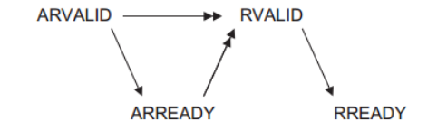
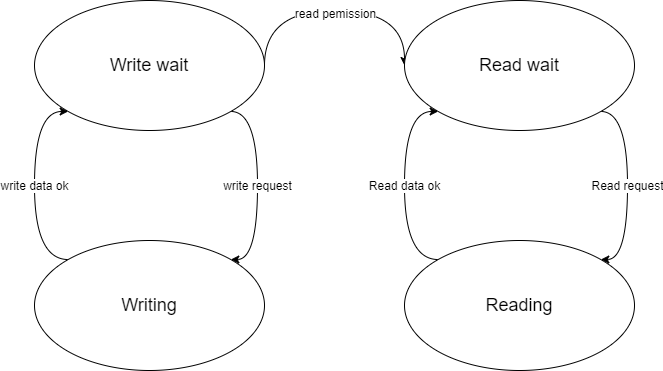
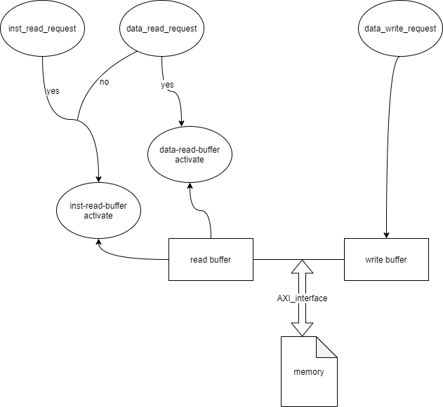

# 总线转换桥

为合理交换信号及避免冲突，CPU必须设定一系列基本的标准来传递信号；同时，为了与工业界其他部件相兼容，总线设计应尽量遵循一个已经完善的标准。

**GadgetMIPS**设计为**对内为类SRAM总线标准、对外为AXI（遵循AMBA\_AXI 协议）总线标准**，并通过一个总线转换桥将信号处理连接。这种设计是考虑到前者处理方便 ，表达直观，更有利于模块之间的耦合，而后者处理高效 ，且支持数据的批量传输。

最终总线转换桥定于`cpu_axi_interface.v`内，并通过龙芯官方的AXI 1×2转换桥进行数据交换。


## 类SRAM总线

类SRAM信号实现交互规定了两个参与主体：一方是发起请求方，称为**主方（master）**，一般为CPU主体；另一方为响应方，称为**从方（slave）**，一般为CPU外设及主存。

访问信号的过程比较直接：主方提出请求，从方返回响应。只有当主方提出请求且得到响应的同时才允许该次请求处理，并在之后进行数据交换。交换完成同样会返回一个响应，得到响应的之后主确认事务处理完毕。

与主流常见的32位总线不同，类SRAM总线设计为了**对内512数据位宽**，这是为了兼容cache单行16个字的设计。实际上，`cpu_axi_interface.v`兼顾一个数据缓存的功能，将一行数据单独存起来用于保存，功效等同于32位类SRAM的理念设计。

设计的类SRAM的信号规定如下：

<table>
  <thead>
    <tr>
      <th style="text-align:left">&#x4FE1;&#x53F7;</th>
      <th style="text-align:left">&#x5BBD;&#x5EA6;</th>
      <th style="text-align:left">&#x65B9;&#x5411;</th>
      <th style="text-align:left">&#x529F;&#x80FD;</th>
      <th style="text-align:left">&#x5BF9;&#x5E94;</th>
    </tr>
  </thead>
  <tbody>
    <tr>
      <td style="text-align:left">req</td>
      <td style="text-align:left">1</td>
      <td style="text-align:left">master-&gt;slave</td>
      <td style="text-align:left">&#x53D1;&#x8D77;&#x8BFB;/&#x5199;&#x8BF7;&#x6C42;&#x3002;&#x9AD8;&#x7535;&#x5E73;&#x6709;&#x6548;</td>
      <td
      style="text-align:left">
        <p>inst_req</p>
        <p>data_req</p>
        </td>
    </tr>
    <tr>
      <td style="text-align:left">wr</td>
      <td style="text-align:left">1</td>
      <td style="text-align:left">master-&gt;slave</td>
      <td style="text-align:left">&#x5224;&#x65AD;&#x4E3A;&#x8BFB;&#x64CD;&#x4F5C;&#x6216;&#x8005;&#x662F;&#x5199;&#x64CD;&#x4F5C;&#x3002;&#x9AD8;&#x7535;&#x5E73;&#x4E3A;&#x5199;</td>
      <td
      style="text-align:left">
        <p>inst_wr</p>
        <p>data_wr</p>
        </td>
    </tr>
    <tr>
      <td style="text-align:left">size</td>
      <td style="text-align:left">4</td>
      <td style="text-align:left">master-&gt;slave</td>
      <td style="text-align:left">&#x4F20;&#x8F93;&#x6570;&#x636E;&#x5927;&#x5C0F;&#xFF0C;&#x4EE5;32&#x4F4D;&#x957F;&#x7684;&#x5B57;&#x4E3A;&#x5355;&#x4F4D;</td>
      <td
      style="text-align:left">
        <p>inst_burst</p>
        <p>data_burst</p>
        </td>
    </tr>
    <tr>
      <td style="text-align:left">addr</td>
      <td style="text-align:left">32</td>
      <td style="text-align:left">master-&gt;slave</td>
      <td style="text-align:left">&#x8BBF;&#x95EE;&#x7684;32&#x4F4D;&#x5730;&#x5740;</td>
      <td style="text-align:left">
        <p>inst_addr</p>
        <p>data_addr</p>
      </td>
    </tr>
    <tr>
      <td style="text-align:left">wstrb</td>
      <td style="text-align:left">64</td>
      <td style="text-align:left">master-&gt;slave</td>
      <td style="text-align:left">&#x5199;&#x4F7F;&#x80FD;&#x4FE1;&#x53F7;&#xFF0C;&#x6BCF;&#x4F4D;&#x9AD8;&#x7535;&#x5E73;&#x4EE3;&#x8868;&#x5BF9;&#x5E94;&#x5B57;&#x8282;&#x5199;&#x6709;&#x6548;</td>
      <td
      style="text-align:left">
        <p>inst_strb</p>
        <p>data_strb</p>
        </td>
    </tr>
    <tr>
      <td style="text-align:left">wdata</td>
      <td style="text-align:left">512</td>
      <td style="text-align:left">master-&gt;slave</td>
      <td style="text-align:left">&#x5199;&#x51FA;&#x7684;&#x6570;&#x636E;</td>
      <td style="text-align:left">wdata</td>
    </tr>
    <tr>
      <td style="text-align:left">addr_ok</td>
      <td style="text-align:left">1</td>
      <td style="text-align:left">slave-&gt;master</td>
      <td style="text-align:left">&#x54CD;&#x5E94;&#xFF1A;&#x5F53;&#x524D;&#x6570;&#x636E;&#x5BF9;&#x5E94;&#x5730;&#x5740;&#x5DF2;&#x7ECF;&#x63A5;&#x53D7;</td>
      <td
      style="text-align:left">
        <p>inst_addr<em>_</em>ok</p>
        <p>data_addr_ok</p>
        </td>
    </tr>
    <tr>
      <td style="text-align:left">data_ok</td>
      <td style="text-align:left">1</td>
      <td style="text-align:left">slave-&gt;master</td>
      <td style="text-align:left">&#x54CD;&#x5E94;&#xFF1A;&#x5F53;&#x524D;&#x6570;&#x636E;&#x5DF2;&#x5168;&#x90E8;&#x6536;/&#x53D1;&#x5B8C;&#x6BD5;</td>
      <td
      style="text-align:left">
        <p>inst_data<em>_</em>ok</p>
        <p>data_data_ok</p>
        </td>
    </tr>
    <tr>
      <td style="text-align:left">rdata</td>
      <td style="text-align:left">512</td>
      <td style="text-align:left">slave-&gt;master</td>
      <td style="text-align:left">&#x8FD4;&#x56DE;&#x7684;&#x6570;&#x636E;</td>
      <td style="text-align:left">
        <p>inst_rdata</p>
        <p>data_rdata</p>
      </td>
    </tr>
  </tbody>
</table>

可以注意到：基本所有类SRAM规定的信号都具有指令（inst）及数据（data）两个收发端，这个设计是为了把取值阶段与访存阶段隔离处理，避免外部线路上发起信号冲突。而至于同时同时接到双方请求的冲突处理，`cpu_axi_interface.v`将会在内部进行解决。

## AXI总线

### AXI协议简介

**GadgetMIPS**设计的AXI总线参照[_**\[AMBA AXI Protocol\]**_](https://developer.arm.com/documentation/ihi0022/b/)。该套协议是**基于突发的**。每个事物在地址通道上都具有地址和控制信息，来描述要传输的数据特性。在主机和从机之间传输的数据，使用一个到从机的写数据通道，或一个到主机的读地址通道。

 AXI 协议允许： 

* 允许在实际数据传输之前发送地址信息；
* 支持多个读写交替（outstanding）传输；
* 支持乱序\(out-of-order\)传输；


关于out-of-order实现：

由于**GadgetMIPS**采用的五级流水线具有流水线暂停及清空的的特性，发生后靠前指令需继续执行而之后的指令将会舍弃。同时，为避免出现写后读相关，同地址的情形下，前条指令的访存过程必须在后条指令之前执行完毕。基于此，**GadgetMIPS**设计为了访存优先、写优先，即访存操作、写操作必须严格在取值操作、读操作之前完成，而不是绝对地实现为乱序传输。


### 事务握手与突发

#### 握手状态转换

类SRAM总线具有握手：只有当请求（req）有效且地址接收响应（addr\_ok）有效才表明地址交互完成（称为一次**握手**）；在这之后只有数据传输响应（data_\__ok）有效才表明事务交互完成。

AXI原理类似，不过更进一步。以读请求握手为例为例：当请求（如arvalid）有效且地址有效（如arready）完成一次握手；在这之后，双方**开始准备下一个握手：从方发送数据，在发送的同时伴随置起读有效的发送信号（如rvalid）；主方则在准备妥当后置起读准备的信号（如rready），只有两者同时有效时，双方才能确认这个数据得到了接收。**

写握手状态转换同理，但信号更为复杂：写结束后还要进行一次写确认握手（bvalid与bready），同样只有双方均置为有效时，才认定这个事务得到了结束。由此可见，AXI最大的特点就是一切交互都必须通过双方完整握手来实现 ——过程叙述繁琐，但由于握手和握手之间没有必然的依赖联系，实际拆分相当容易。 





#### 突发处理

AXI协议下明显能提高效率的一大原因是**支持突发（burst）传输**。


如前所述，AXI每一步交互都拥有握手，包括单个数据的传输阶段。实际上，从方可以**间断地、多次地发送数据**（次数及大小由之前请求给定）**，同时伴随返回响应（如rvalid）有效**；当最后一个数据返回时，**将伴随返回响应有效以及结束响应（如rlast）有效，**表明事务交互完成。这样一来，一次请求便可传输大量的数据，而不用迫于总线宽度发起大量请求事务，等待多组握手循环了。

由于AXI信号数目较多，展开较为复杂，可自行查阅手册。以下展示**GadgetMIPS**的部分接口：

```text
    //inst sram-like 
    input  wire        inst_req     ,
    input  wire[3:0]   inst_burst   , // 0000 -> 1 word, 1111 -> 16 words
    input  wire[31:0]  inst_addr    ,
    output reg [511:0] inst_rdata   ,
    output wire        inst_addr_ok ,
    output reg         inst_data_ok ,
    
    //data sram-like 
    input  wire        data_req     ,
    input  wire[3:0]   data_burst   , // 0000 -> 1 word, 1111 -> 16 words
    input  wire        data_wr      ,
    input  wire[63:0]  data_strb    ,
    input  wire[31:0]  data_addr    ,
    input  wire[511:0] data_wdata   ,
    output reg [511:0] data_rdata   ,
    output wire        data_addr_ok ,
    output reg         data_data_ok ,

    //axi
    //ar
    output wire[31:0]  araddr       ,
    output wire[7 :0]  arlen        ,
    output wire[2 :0]  arsize       ,
    output wire[1 :0]  arburst      ,
    output wire[3 :0]  arcache      ,
    output reg         arvalid      ,
    input  wire        arready      ,
    //r
    input  wire[31:0]  rdata        ,
    input  wire[1 :0]  rresp        ,
    input  wire        rlast        ,
    input  wire        rvalid       ,
    output reg         rready       ,
    //aw          
    output wire[31:0]  awaddr       ,
    output wire[7 :0]  awlen        ,
    output wire[2 :0]  awsize       ,
    output wire[1 :0]  awburst      ,
    output wire[3 :0]  awcache      ,
    output reg         awvalid      ,
    input  wire        awready      ,
    //w          
    output wire[31:0]  wdata        ,
    output wire[3 :0]  wstrb        ,
    output wire        wlast        ,
    output reg         wvalid       ,
    input  wire        wready       ,
    //b           
    input  wire[1 :0]  bresp        ,
    input  wire        bvalid       ,
    output reg         bready  
```

## 内部转换

**GadgetMIPS**转换遵循几个原则：

* 多个请求冲突时，写优先、访存阶段优先（原因上文已经提及）；
* 内部实现数据缓存，暂存未经发送的数据。
* 默认以字为传输单位，但经由AXI部分传输的字数量可以更改；

### 优先级处理

读/写中间状态转换都是位于一个always时序逻辑块内实现。写操作仅有访存阶段才可能发生，仅需写请求发生即可开始运行（line: 19）；读操作则可能在取指阶段与访存阶段发生，需要写请求开始初步运行（line: 54），且优先判断访存阶段的请求（line: 56）；在这之后，读状态机还需等待写操作完成（line: 58, 70），这个操作才能继续进行，否则读请求将会被阻塞。



```text
// SRAM握手
always @ (posedge clk) begin
    if (!resetn) begin
        ...
    end else begin
        // 正常逻辑
        if (!write_en) begin
            // 当前没有写操作
            if (data_wr) begin
                // 如果上一个是写
                data_data_ok <= 1'b0; // 清除数据握手
            end
            if (data_req && data_wr) begin
                ...
            end else begin
                // 不写则保证写状态机关闭
                write_en <= 1'b0;
            end
        end else begin
            // 当前有写操作
            if (write_done) begin
                // 写完了
                data_data_ok <= 1'b1; // 进行数据握手
                write_en <= 1'b0; // 关闭写状态机
            end else begin
                // 还在写
                data_data_ok <= 1'b0; // 不握手
                write_en <= 1'b1; // 保持写状态机打开
            end
        end

        if (!read_en) begin
            // 当前没有读操作
            if (!data_wr) begin
                // 如果上一个是读
                data_data_ok <= 1'b0; // 清除数据握手
            end
            inst_data_ok <= 1'b0; // 清除数据握手
            if (data_req && !data_wr) begin
                // data要读
                // 记录读信息
                ...

                read_en <= 1'b1; // 启动读状态机
            end else if (inst_req) begin
                // inst要读
                ...

                read_en <= 1'b1; // 启动读状态机
            end else begin
                // 不写则保证读状态机关闭
                read_en <= 1'b0;
            end
        end else begin
            // 当前有读操作
            if (read_if_or_mem[1]) begin
                // 读data
                if (read_if_or_mem[0]) begin
                    // 读完了
                    ...
                    data_data_ok <= 1'b1; // 进行数据握手
                    read_en <= 1'b0; // 关闭读状态机
                end else begin
                    // 还在写
                    data_data_ok <= 1'b0; // 不握手
                    read_en <= 1'b1; // 保持读状态机打开
                end
            end else begin
                // 读inst
                if (read_if_or_mem[0]) begin
                    // 读完了
                    ...

                    inst_data_ok <= 1'b1; // 进行数据握手
                    read_en <= 1'b0; // 关闭读状态机
                end else begin
                    // 还在写
                    inst_data_ok <= 1'b0; // 不握手
                    read_en <= 1'b1; // 保持读状态机打开
                end
            end
        end
    end
end
```

### 数据缓存与选择

类SRAM的addr\_ok信号一般用来确认地址传输完毕，但实际上也可用来传输其他相关数据。**GadgetMIPS**在内部设置了多组16个字长的数据缓存块，在接收到请求、接受地址的同时开始接收数据。缓存部分同样具有在两个收发端之间进行数据选择的功能。



只有当数据被全部缓存时，`addr_ok`有效信号才会传回给CPU；同样，当数据被全部交换完毕后，总线桥才会CPU将`data_ok`设为有效。

```text
reg[31:0] read_addr;
reg[3:0] read_burst;
reg[31:0] read_result[15:0];
// [1]: 0 inst, 1 data; [0]: 0 reading, 1 done.
reg[1:0] read_if_or_mem;
reg read_en; // 使能读状态机，为1时读状态机开始启动

reg[31:0] write_addr;
reg[3:0] write_burst;
reg[31:0] write_data[15:0];
reg[3:0] write_strb[15:0];
reg write_done; // 0 writing, 1 done
reg write_en; // 使能写状态机，为1时写状态机开始启动

...

if (read_if_or_mem[1]) begin
    // 读data
    if (read_if_or_mem[0]) begin
        // 读完了
        data_rdata[511:480] <= read_result[0];
        data_rdata[479:448] <= read_result[1];
        data_rdata[447:416] <= read_result[2];
        data_rdata[415:384] <= read_result[3];
    ...
    end else begin
    // 读inst
    if (read_if_or_mem[0]) begin
        // 读完了
        inst_rdata[511:480] <= read_result[0];
        inst_rdata[479:448] <= read_result[1];
        inst_rdata[447:416] <= read_result[2];
        inst_rdata[415:384] <= read_result[3];

...
```

### 变长burst传输

最终版的**GadgetMIPS**一般采用两种长度访问：对于uncache字段的访问或是单独的请求，进行单个数据的访问（burst = 4'b0000）；对于cache更新一整行的操作，进行行长度即16个数据的访问（burst = 4'b1111）。每个数据规定长恒为一个字（size = 4'b0011）。

实际上，`cpu_axi_interface.v`支持1至16个字的**任意长度突发**。在原先通过数据缓存存储数据后，总线桥将会启用一个计数器保存burst要求的传输数目；向外设发送数据时，计数器将逐步更新，确保所有的（且仅限）要求的数据被发送成功。

展示一个读操作样例：

```text
2'b01: begin
    // 写AR通道进行AXI地址握手
    if (arready && arvalid) begin
        // AR握手成功
        read_counter <= (4'b1111 - arlen[3:0]); // 清零counter  
        // 如果arlen是burst传输，则低位是f，减去后counter正好为0
        // 如果不是burst传输，保证最后一次传输一定写在31:0处
        arvalid <= 1'b0; // 撤销握手信号
        read_status <= 2'b10;
        rready <= 1'b1; // 准备接收数据
    end else begin
        arvalid <= 1'b1; // 保持AR握手
        read_status <= 2'b01;
        rready <= 1'b0;
    end
end 

2'b10: begin
    // 等待R通道的数据握手
    if (rready && rvalid) begin
        // 本次握手成功
        read_result[read_counter] <= rdata;
        read_counter <= read_counter + 1;
        
        // 最后一个则结束传输
        if (rlast) begin
            // 这里设置读结束，下一个周期应该关闭读状态机使能
            // 从而中断状态机的执行，否则就原地等待
            read_if_or_mem[0] <= 1'b1; // 表示读结束
            rready <= 1'b0;
        end
    end
end 
```


